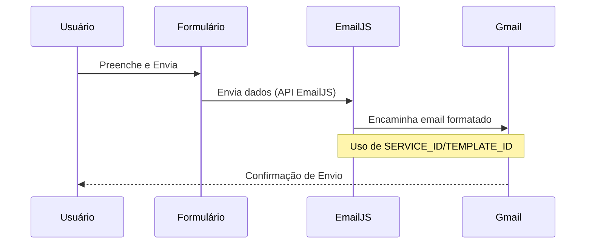

# 🚀 Portfólio Pessoal - Matheus Bull

<div align="center">


**Site profissional moderno desenvolvido com foco em performance e experiência do usuário (UX)**

[🌐 Deploy Pendente](#deploy) • [📧 Contato](mailto:bullproducoes4@gmail.com) • [💼 LinkedIn](https://linkedin.com/in/matheus-bull-85277137a)

</div>

---

## 📖 Sobre o Projeto

Portfólio pessoal construído para apresentar **Matheus Bull**, estudante de Desenvolvimento de Sistemas no SENAI. O objetivo é servir como um cartão de visitas digital, destacando minhas **habilidades** e **projetos** com foco em:

* **Performance:** Otimização para SEO e Core Web Vitals com **Next.js**.
* **Design:** Design responsivo (**Mobile-first**) e moderno com **Tailwind CSS**.
* **Comunicação:** Formulário de contato funcional via **EmailJS**.

---

## 🛠 Tecnologias Utilizadas

O projeto é uma aplicação **SPA (Single Page Application)** de alta performance, desenvolvida em JavaScript.

```mermaid
graph TB
A[Frontend] --> B[Next.js 13.5 (React)]
A --> C[Tailwind CSS 3.3]
A --> D[HTML5/CSS3]
F[Serviço de Email] --> G[EmailJS]
I[Ferramentas] --> J[VS Code]
I --> K[Git/GitHub]
I --> L[Vercel (Deploy)]
```

---

# ⚙️ Instalação e Execução Local

## Pré-requisitos

Node.js 16.8+
npm ou yarn
Git

# 🚀 Passos

1. Clone o repositório:

git clone [https://github.com/matheuzinn7198/portfolio-matheus-bull.git](https://github.com/matheuzinn7198/portfolio-matheus-bull.git)

2. Acesse a pasta e instale as dependências:

cd portfolio-matheus-bull
npm install

3. Execute em modo desenvolvimento:

npm run dev

4. Acesse no navegador: http://localhost:3000

---

# 📧Configuração do EmailJS

O envio de mensagens é feito no cliente, sem a necessidade de um servidor backend próprio.

## Fluxo do Envio



---

# 📝 Credenciais

Para o funcionamento do formulário, configure as seguintes credenciais no componente de contato após criar sua conta no EmailJS: SERVICE_ID, TEMPLATE_ID, e PUBLIC_KEY.

---

# 🌐 Deploy e Status <a id="deploy"></a>

O deploy será realizado na Vercel, plataforma recomendada para projetos Next.js.

Status de Deploy

| Plataforma | Status | Ação Necessária |
| :---: | :---: | :--- |
| Vercel (Recomendado) | 🔄 Pendente | Conectar o repositório no Vercel para Build Automático. |
| GitHub Pages | 🔄 Configurável | Executar `npm run export` e configurar a branch `gh-pages`. |

---

🎯 Funcionalidades e Próximos Passos

| Status | Funcionalidade | Descrição |
| :---: | :--- | :--- |
| ✅ | Design Responsivo | Adaptação perfeita em todos os dispositivos. |
| ✅ | Formulário EmailJS | Envio de mensagens sem backend próprio. |
| ✅ | SEO Otimizado | Uso de meta tags e Next.js para melhor ranqueamento. |
| 🔄 | Modo Claro/Escuro | Implementação de toggle de tema. |
| 🔄 | Blog Integrado | Adicionar uma seção de artigos/posts. |

---

🤝 Como Contribuir

Siga os padrões de Pull Request para contribuir com novas funcionalidades ou correções:

1. Faça um Fork do projeto.

2. Crie uma nova branch: git checkout -b feature/nome-da-feature

3. Commit suas mudanças: git commit -m 'feat: Adiciona nova funcionalidade'

4. Abra um Pull Request.

---

# 👨‍💻 Desenvolvedor

<div align="center">Matheus Bull 

🚀Estudante de Desenvolvimento de Sistemas - SENAI

<a href="https://linkedin.com/in/matheus-bull-85277137a"></a><a href="https://www.google.com/search?q=https://github.com/matheuzinn7198"></a><a href="mailto:bullproducoes4@gmail.com"></a>

⭐️ Se este projeto te ajudou, deixe uma estrela no repositório!

Desenvolvido com 💙 por Matheus Bull</div>